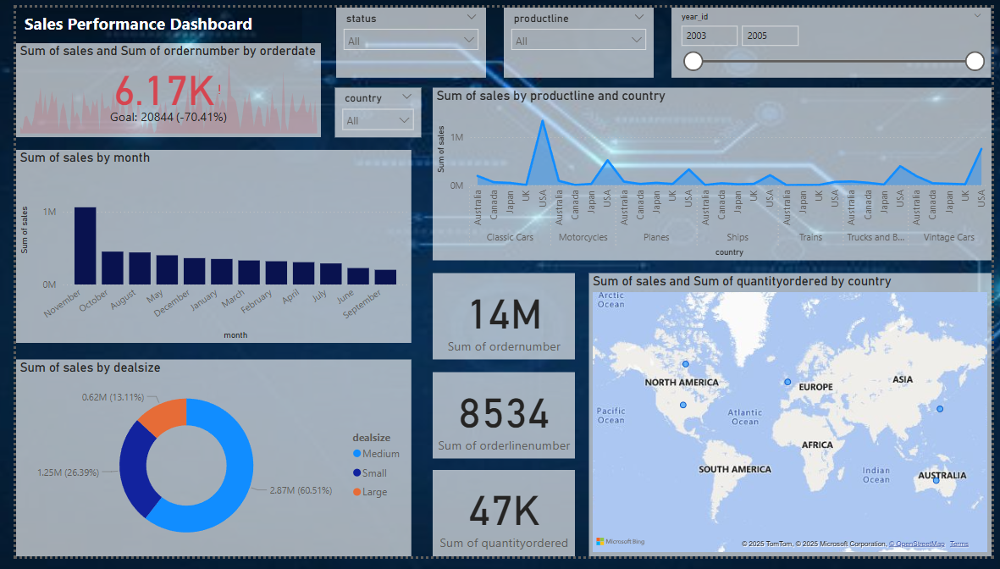

# Data Performance Analysis 📊

This project explores business performance trends using **Power BI** and **Python**, combining interactive dashboards with data analysis.

---

## 📁 Contents

- `sales_analysis.pbix` — Interactive Power BI dashboard
- `sales_data_analysis.ipynb` — Jupyter notebook with EDA and visualizations
- `sales_data_sample.csv` — Raw dataset used for analysis

---

## 📊 Power BI Dashboard

You can explore the dashboard by downloading the `.pbix` file and opening it in **Power BI Desktop**:  
👉 [Download PBIX](https://github.com/anushka-kudale/Sales-Data-Analysis/blob/main/sales_analysis.pbix)

---

## 🧠 Jupyter Notebook

The notebook includes:
- Data cleaning & preprocessing
- Exploratory Data Analysis (EDA)
- Visualizations using Matplotlib and Seaborn
- Correlation matrix and key business insights

📓 [View Notebook](https://github.com/anushka-kudale/Sales-Data-Analysis/blob/main/sales_data_analysis.ipynb)

---

## 📄 Dataset

📝 [View CSV Dataset](https://github.com/anushka-kudale/Sales-Data-Analysis/blob/main/sales_data_sample.csv)

---

## 🎯 Goals

- Analyze overall sales performance using visual dashboards and Python
- Identify top-performing products, regions, and deals
- Understand monthly and quarterly sales trends
- Discover patterns in customer purchasing behavior
- Use visual KPIs to support business decisions

---

## 🛠️ Tools Used

- Python: `pandas`, `matplotlib`, `seaborn`
- Power BI (Desktop)
- Jupyter Notebook

---

## 📸 Dashboard Preview

This dashboard provides an interactive view of global sales data.  
It includes KPIs, sales trends, product breakdowns, and country-wise insights.

---

## 🚀 How to Use

1. **Power BI**: Open `.pbix` file using Power BI Desktop  
2. **Notebook**: Run `.ipynb` file in Jupyter or Google Colab  
3. **CSV**: Open `.csv` with Excel, Python, or any spreadsheet tool

---

## 📫 Contact

Connect with me on [LinkedIn](https://www.linkedin.com/in/anushka164)  
Check out more projects on [GitHub](https://github.com/anushka-kudale)